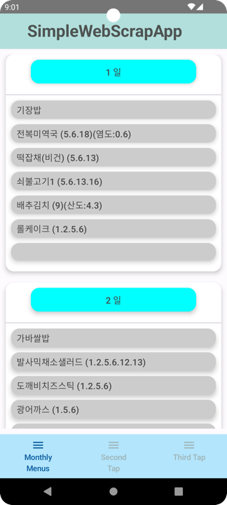

# RecipeByGemini Application
## Introduce app
This app uses the Jsoup API to scrap the data from http webpage by html format and extract meaningful data. After that, display scrapped data with Jetpack Compose UI.

## Purpose
Created an app with the purpose of to scrap the data from http webpage by html format and extract meaningful data and display scrapped data with Jetpack Compose UI.

## Specific SDK / Library / function list
- Jsoup
- Jetpack Compose
- Dagger-Hilt
- Kotlin Coroutines
- Gson
- MVVM architecture
